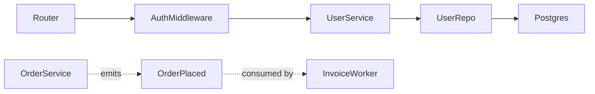

# KNOWLEDGE-GRAPH.md Format

## Structure

```md
# Code Knowledge Graph

**Scope**: {whole-repo | module: src/foo | blast-radius from: SymbolName}
**Last updated**: 2026-04-30
**Source commit**: a1b2c3d (optional, omit if not in git)

## Nodes

| id | kind | location | purpose |
|---|---|---|---|
| Router | module | src/http/router.ts | Maps HTTP routes to handlers |
| AuthMiddleware | class | src/http/auth.ts:12 | Verifies JWTs, attaches user to request |
| UserService | class | src/services/user.ts:8 | Orchestrates user-related operations |
| UserRepo | class | src/repos/user.ts:5 | Persists users to Postgres |
| Postgres | external | — | Primary datastore |
| OrderPlaced | event | src/events/order.ts:3 | Emitted when an order is created |

## Edges

| from | to | kind | note |
|---|---|---|---|
| Router | AuthMiddleware | configures | wired in router.use() |
| AuthMiddleware | UserService | calls | resolves user from token |
| UserService | UserRepo | calls | |
| UserRepo | Postgres | reads, writes | table: users |
| OrderService | OrderPlaced | emits | |
| InvoiceWorker | OrderPlaced | consumes | |

## Diagram



## Hot paths

- **Authenticated request**: `Router → AuthMiddleware → Handler → UserService → UserRepo → Postgres`
- **Order placement**: `OrderHandler → OrderService → OrderRepo → Postgres`, then `OrderService` emits `OrderPlaced` which `InvoiceWorker` consumes
- **Background reconciliation**: `ReconcileJob (cron) → OrderRepo → Postgres`, compares with external billing API

## Open questions

- Is `LegacyAuthMiddleware` (src/http/legacy-auth.ts) still wired? No callers found, but config references it.
- `NotificationService` appears to be called from both sync and async paths — confirm whether ordering matters.
```

## Field rules

### Nodes table

- **id** — short, unique, matches the actual symbol name in code where possible. Greppable. No spaces.
- **kind** — one of: `module`, `class`, `function`, `type`, `interface`, `event`, `route`, `job`, `external`. Add new kinds sparingly.
- **location** — `path/to/file.ext` for modules, `path/to/file.ext:LINE` for symbols. `—` for `external`.
- **purpose** — one sentence, present tense, focused on responsibility (not implementation). If you can't write it without restating the name, you don't understand the node well enough yet.

### Edges table

- **from** / **to** — must match a node `id` exactly. The graph breaks otherwise.
- **kind** — one of: `imports`, `calls`, `extends`, `implements`, `reads`, `writes`, `emits`, `consumes`, `configures`. Multiple kinds allowed, comma-separated (e.g. `reads, writes`).
- **note** — optional. Use for non-obvious detail (table name, event payload type, "only on startup", etc.). Leave blank otherwise.

### Diagram

- Mermaid `graph LR` (or `TD`) for module-level / small graphs.
- Solid arrows for synchronous calls; dotted arrows for events / async.
- **Omit the diagram if >40 nodes.** Tables are still useful; the diagram isn't.
- Don't try to encode every edge in the diagram — pick the structurally important ones. The tables are the source of truth.

### Hot paths

- 2–5 bullets, each one a narrative traversal that matters operationally (request lifecycle, critical background job, fan-out on a key event).
- Use `→` to chain nodes. Reference node ids exactly.
- If you can't name a hot path, the graph isn't capturing what matters — re-scope.

### Open questions

- Things you couldn't determine during exploration. Better to flag than guess.
- Resolve or remove on the next pass.

## Rules

- **Match the code, not aspirations.** If the code calls it `UserSvc`, the node id is `UserSvc`. Don't rename for prettiness.
- **One sentence per purpose.** Multi-paragraph descriptions belong in code comments or ADRs, not here.
- **No transitive edges.** If A calls B and B calls C, do not add A → C.
- **Skip language built-ins and trivial utilities.** `String`, `Array`, `lodash.get` — not nodes.
- **External nodes don't get expanded.** They appear as edge targets only.
- **When pruning, prefer fewer nodes with strong edges over many nodes with weak edges.** A graph with 30 well-connected nodes is more useful than 200 sparsely connected ones.

## Multi-context repos

If `CONTEXT-MAP.md` exists, each context gets its own `KNOWLEDGE-GRAPH.md` next to its `CONTEXT.md`:

```
src/
├── ordering/
│   ├── CONTEXT.md
│   └── KNOWLEDGE-GRAPH.md     ← scoped to ordering
└── billing/
    ├── CONTEXT.md
    └── KNOWLEDGE-GRAPH.md     ← scoped to billing
```

Cross-context edges go in *both* graphs (each side records its end of the edge), with `external` kind on the receiving side if the producer is in another context.

## Relationship to CONTEXT.md

- `CONTEXT.md` defines **what the words mean** (domain terms, language, ambiguities resolved).
- `KNOWLEDGE-GRAPH.md` defines **how the code is wired** (nodes and edges).
- Node ids should match terms in `CONTEXT.md` where domain concepts are realised in code. If `CONTEXT.md` says **Order** and the code has an `Order` class, they should share the name. If they don't, that's a finding worth flagging in CONTEXT.md's "Flagged ambiguities".
